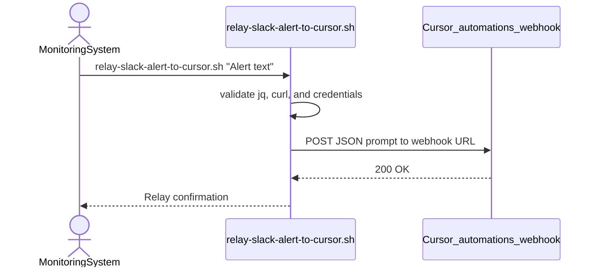

# Druttzen

Cloud agent environment for [Druttzen/Druttzen](https://github.com/Druttzen/Druttzen).

## Cursor Automations — issue resolutions

Common automation failures and how to fix them.

### 1. Automation only runs for you (not teammates)

**Cause:** Slack trigger "from" is set to **Authenticated Cursor users**.

**Fix:** [cursor.com/automations](https://cursor.com/automations) → edit automation → Slack trigger → set **from** to **Anyone in the channel**.

Also confirm `/invite @Cursor` was run in the target public channel.

### 2. Thread replies do not trigger the automation

**Cause:** Without a filter, Slack triggers only fire on top-level channel messages.

**Fix:** Add a **keyword** or **regex** filter on the Slack trigger. That also enables threaded replies.

### 3. Slack bot / monitoring alerts stopped triggering (regression)

**Cause:** As of mid-2026, bot-authored Slack messages no longer trigger "New message" automations. Manual user posts still work.

**Fix (recommended):** Switch the automation to a **Webhook** trigger and relay alerts with `scripts/relay-slack-alert-to-cursor.sh`:

```bash
export CURSOR_AUTOMATION_WEBHOOK_URL="https://api.cursor.com/automations/webhook/..."
export CURSOR_AUTOMATION_API_KEY="your-api-key"
./scripts/relay-slack-alert-to-cursor.sh "Production error: checkout timeout"
```

Structured alerts with metadata:

```bash
./scripts/relay-slack-alert-to-cursor.sh --json <<'EOF'
{"message":"checkout timeout","severity":"critical","service":"payments","environment":"production"}
EOF
```

Or pass metadata via environment variables:

```bash
ALERT_SEVERITY=critical ALERT_SERVICE=payments ALERT_ENVIRONMENT=production \
  ./scripts/relay-slack-alert-to-cursor.sh "checkout timeout"
```



**Credential handling:** Store `CURSOR_AUTOMATION_WEBHOOK_URL` and `CURSOR_AUTOMATION_API_KEY` in your platform's secrets manager (GitHub Actions secrets, AWS Secrets Manager, Vault, etc.). Avoid exporting them in shell history, committing them to git, or logging them in CI output. Rotate the API key from [cursor.com/automations](https://cursor.com/automations) if it is ever exposed.

**Timeouts:** Override relay timeouts (seconds) if needed:

```bash
export CURSOR_AUTOMATION_CONNECT_TIMEOUT=5
export CURSOR_AUTOMATION_MAX_TIME=15
```

**Temporary workaround:** Manually repost the alert from a human Slack account.

### 4. Teammates cannot follow up in automation threads

**Cause:** Known bug — Team Followups does not apply to agents created by automations.

**Workaround:** Start a new thread with `@Cursor agent [your prompt]` instead of replying in the automation thread.

### 5. `missing_scope` or bot cannot join channel

**Fix:** In the target public Slack channel, run `/invite @Cursor`.

### 6. Automation has no repo / wrong repo

**Fix:** In automation settings, attach the correct repository or multi-repo environment. For manual Slack runs use:

```text
@Cursor repo=owner/repo branch=main Fix the login bug
```

### 7. One specific Slack user is silently ignored

**Cause:** User may not be on your Cursor team.

**Fix:** Invite them to the Cursor team and have them accept. Re-test after they join.

### 8. PR comment automations ignore bot comments

**Cause:** Comments from `GITHUB_TOKEN` and GitHub Apps are filtered.

**Fix:** Post trigger comments with a PAT, or add a helper Action that reposts bot comments as a human user.

---

## Quick diagnostic

| Symptom | Likely fix |
|--------|------------|
| Only I can trigger it | Set Slack "from" → Anyone in the channel |
| Threads ignored | Add keyword/regex filter |
| Bot alerts dead | Use webhook relay script |
| Follow-up blocked | `@Cursor agent` in a new thread |
| Wrong codebase | Set repo in automation or `repo=` inline |

## Links

- [Automations dashboard](https://cursor.com/automations)
- [Automations docs](https://cursor.com/docs/cloud-agent/automations)
- [Slack integration](https://cursor.com/docs/integrations/slack)
- [Cloud Agents settings](https://cursor.com/dashboard/cloud-agents)
